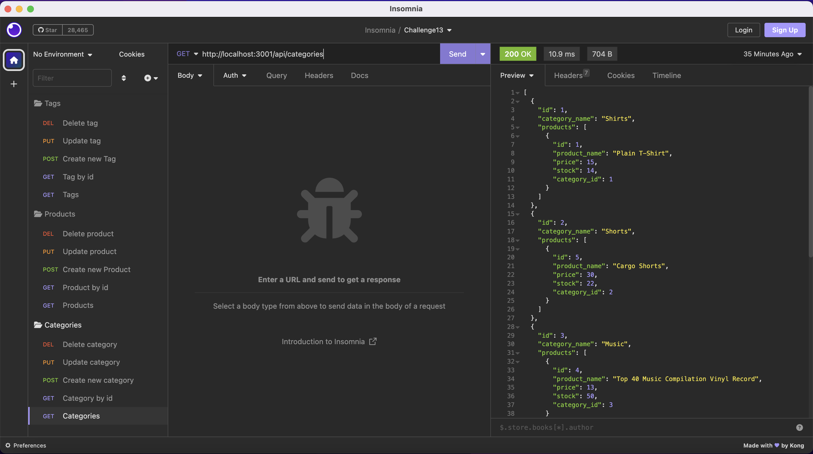

# 13 Object-Relational Mapping (ORM): E-Commerce Back End

## The Task

The task of this module (Challenge #13) was to build the back end for an e-commerce site by modifying starter code. The starter code was a Express.js API to use Sequelize to interact with MySQL database. The columns of all models were created as well as the routes for different requests (GET, POST, PUT and DELETE) in order to create, upadte or delete information of categories, products and tags in the database.

Because this application is not deployed, in Mock-Up section you cand find a demo video of how the requests work using Insomnia. 

## Given User Story

```md
AS A manager at an internet retail company
I WANT a back end for my e-commerce website that uses the latest technologies
SO THAT my company can compete with other e-commerce companies
```

## Mock-Up

The following video shows the application's GET routes to return all categories, all products, and all tags; GET routes to return a specific category, product or tag by its "id"; POST route to create new categories, products and tags; PUT routes to update information of categories, products and tags and DELETE route to delete previous requests or information of the database related to categories, products or tags. This was tested using Insomnia. 

[](https://drive.google.com/file/d/1WdL9dAvatnQ0-E7UhEeMgjP0WbW0VwXM/view?usp=sharing)

---
© 2023 edX Boot Camps LLC. Confidential and Proprietary. All Rights Reserved. Back end developed by María Fernanda Marroquín.
